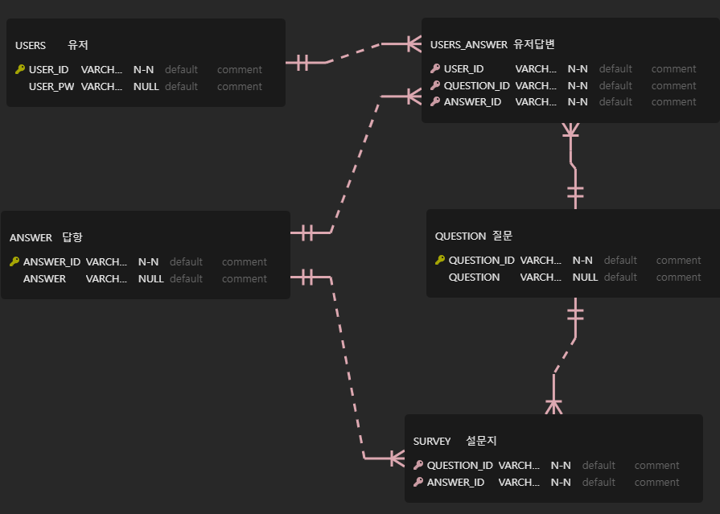

# KH_academy_project - 끝까지 버팀

### 구성원
PM : 길진수  
Member2 : 김용범  
Member3 : 김병근

### ERD  

### 화면정의서
- 길진수, 김병근, 김용범 : [화면정의서](./refers/%ED%99%94%EB%A9%B4%EC%A0%95%EC%9D%98%EC%84%9C_%EB%81%9D%EA%B9%8C%EC%A7%80%EB%B2%84%ED%8C%80.pdf)
### 요구사항 정의서
- 길진수, 김병근, 김용범 : [요구사항 정의서](./refers/%EC%9A%94%EA%B5%AC%EC%82%AC%ED%95%AD%EC%A0%95%EC%9D%98%EC%84%9C_%EB%81%9D%EA%B9%8C%EC%A7%80%EB%B2%84%ED%8C%80.xlsx%20-%201%EC%B0%A8%20%EC%A0%95%EC%9D%98%EC%84%9C.pdf)
### 소스코드
김병근   
- 입력값에 따라 설문지, 통계, 삭제로 이동 : [Main 코드](./src/CarMain.java)  
- 회원가입 후 설문지 내용을 화면에 표시 : [설문지 코드](./src/CarSurvey.java)

김용범  
- 사용자별 답변결과 및 각 문항별 답변 수 표시 : [통계 코드](./src/CarStats.java)

길진수  
- ID와 PW가 일치하면 설문지 삭제 : [삭제 코드](./src/CarDelete.java)
